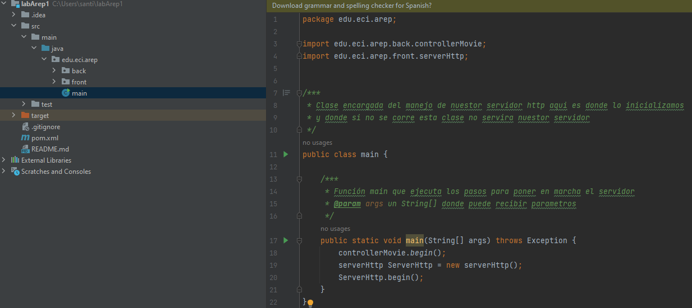
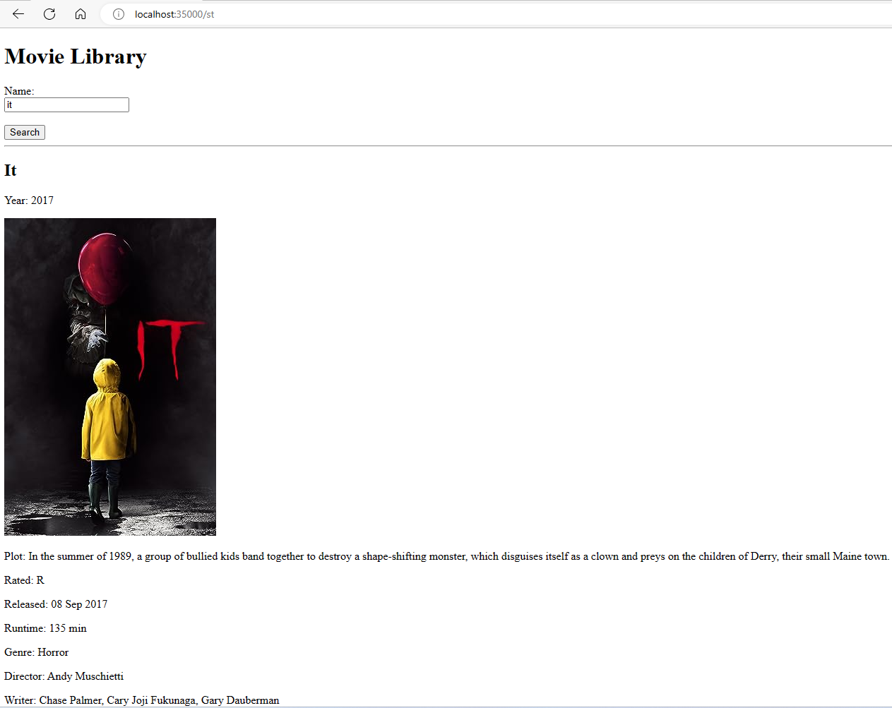
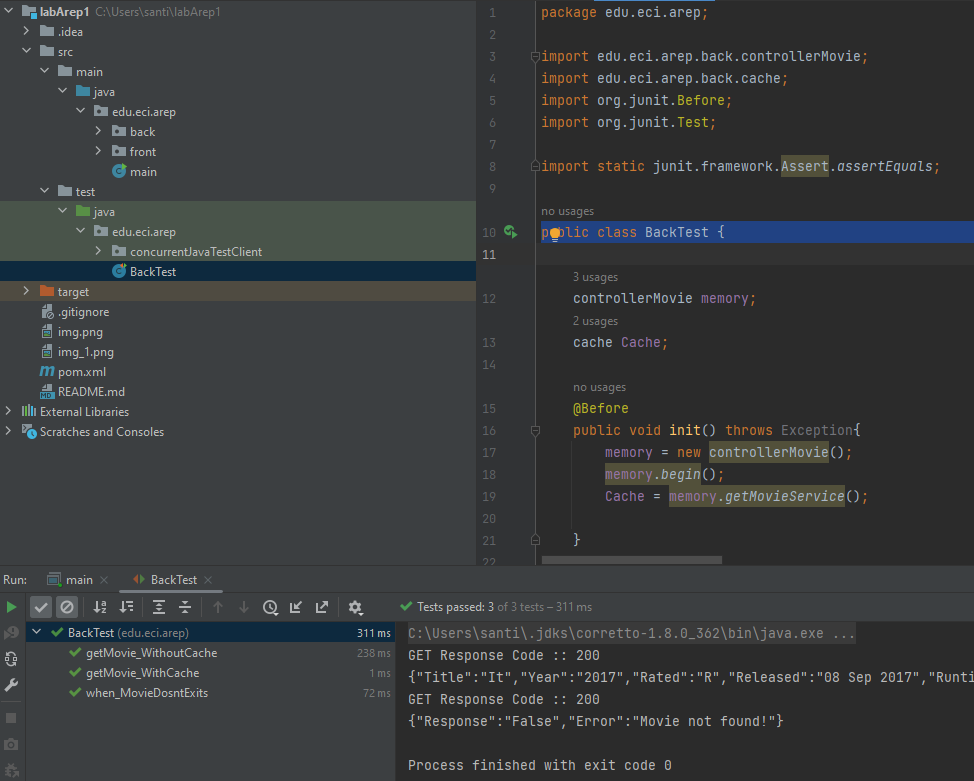
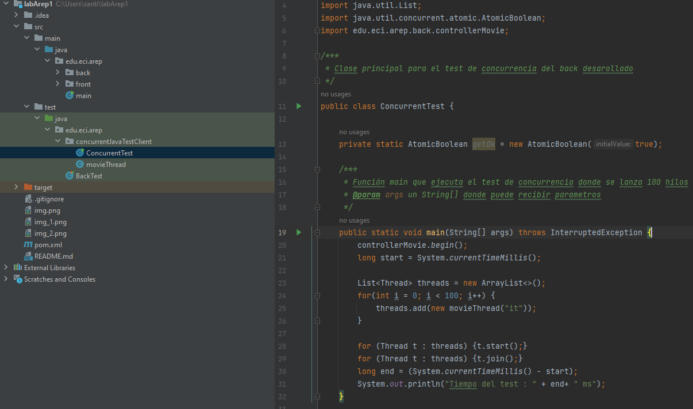
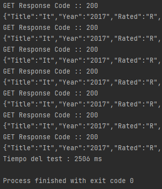
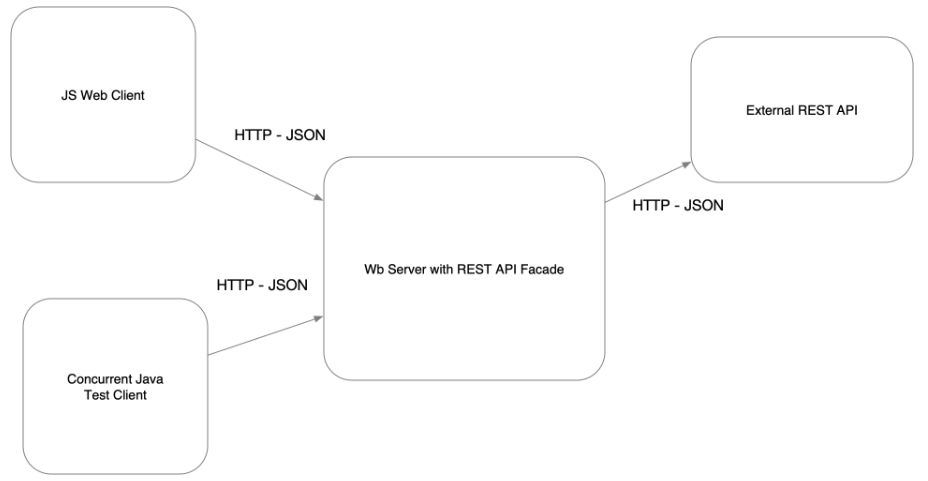

# Laboratorio 1 AREP
este proyecto consiste en construir una aplicacion para consultar la informacion
las peliculas de cine. para esto se desarollo un arquitectura simple, donde simplemente
tenemos un front echo en html y javascript, un back echo totalmente en java y una api
externa 

## Iniciando

### Prerrequisitos

* Git
* Java
* Maven
* 1 IDE (en este proyecto se trabajo en intellij)

### Instalando el proyecto

Lo primero será traer del repositorio remoto que encontramos en git
a nuestro entorno local para eso ejecutamos el siguiente comando en
la terminal donde funcionen los comandos git

```
git clone https://github.com/santiagoOsp01/LabArep1.git
```

Esto creará un repositorio localdonde accederemos y ejecutaremos 
con nuestro IDE escogido y el siguiente comando.

```
mvn package
```

luego de que ya lo tengamos vamos a ejecutar la clase principal para que nuestra
aplicacion funcione



Eso hará que ya este disponible nuestra aplicacion. Para corroborar pega y copia o presiona
la siguiente url http://localhost:35000.

al buscar una pelicula aparecera lo siguiente.



## Corriendo los tests

En este proyecto se implementaron dos tipos de test, 
los primeros son los Unitest que se pueden ejecutar
dirigiendose a la carpeta de test a la clase llamada backTest y correrla
como podemos ver a continuacion



Estos test se realisaron para probar la logica implementada en el back


### clientTestConcurrency

para estos text que prueban la concurency de igual manera nos vamos
a ir a la carpeta de test y ahi abri la capeta denominada concurrencyJavaTestClient
y ahi entraremos a la clase concurrencyTest y ejecutaremos el main



Luego de ejecutarla nos aparecera lo siguiente:



Esto enviará 100, y nos devolverá el tiempo en milisegundos de lo que tardo nuestro back en responderlas todas como se muestra a continuación.

## Documentación
Primero debemos ejecutar el siguiente comando para crear la documentación.
```
mvn javadoc:javadoc
```
En la siguiente ruta desde nuestra carpeta del proyecto podemos encontrar la documentación.

```
./target/site/apidocs
```
Si ingresamos a esta podemos ver que hay un index.html que al abrir nos mostrara la siguiente pagina.


## Construido con

* [Maven](https://maven.apache.org/) - Administrador de dependencias
* [OMDAPI](https://www.omdbapi.com) - API externa de consulta

## Version

1.0-SNAPSHOT

## Autores

Santiago Ospina Mejia 

## Licencia

GNU General Public License family

## Diseño

Para ver con más detalle el diseño, debemos ver la arquitectura 
que nos dieron a seguir.



### Extensibilidad

como en la arquitectura que pudimos observar es relativamente facil
cambiar los componentes porque no tienen mucha dependencia entre ellos
lo que significa que facilmente se pueden cambiar estos componentes
por unos mas fuertes y rapidos, ya que se estan comunicando a traves de apis
por lo cual muy facilmente el back lo podriamos desarollar en python 

y como nosotros desarollamos nuestro back es facil por asi decirlo cambiar
nuestro cache, o simplemente agregarle funcionales a nuestro back como ahorra
restringir las peliculas para menores de edad esto se lograria sin necesitar
muchos cambios.

### Patrones

* tenemos un patron de diseño singleton, ya que como vemos son clases
que solo son instanciadas una ves como vemos con el front y el back
donde solo tenemos un servidor http y un back api donde utilizamos un 
unico cache

* se puede observar estilo arquitectónico Cliente-Servidor, donde podemos
ver un  fallo en nuetra arquitectura ya que nuestra aplicacion cuenta
con dos puntos de fallos que si se cae la api externa o nuestro back
nuestro aplicacion dejaria de funcionar, por otro lado nos ofrece la
centralizacion de los recursos, facil mantenimiento y un diseño que 
pueden entender gran parte de la gente

### Modularización
como observamos en la arquitectura nuestra aplicacion cuenta clases con
responsabilidades claras como vemos en especifico:

* Front: contiene el servidor http que es el encargado de hacer las 
peticiones a nuestro back y mostrar al usuario la informacion que reciba de la
api
* back: esta es la encargada de contener nuestra logica, la de consumir el api
externo y llevar la informacion al front
* Cache: esta clase la simulamos con un cache y su proposito es la de mejorar
el rendimiento de nuestra aplicacion ya que le ahorra el back consultar el api
externo ya que si es una pelicula ya pedida la informacion quedara guardada en
el cache y no tendra que volver a consultar otra ves la api externa
* api externa: es una api que consume nuestro back y nos da informacion que 
necesitamos de de la peliculas, este es un recurso externo por lo que no 
tenemos control sobre este lo cual puede generar diferentes problemas, pero
nos ahorra demasiado tiempo, ya que no tendriamo que crear nosotros esta api

## Agradecimientos

* Luis Daniel Benavides profesor de AREP

## Tener en cuenta

en la clase ya hablada de los test BackTest no pasa una prueba cuando se ejecuta
el comando de mvn package por lo que despues de correrlas manualmente como
mostre en el readme comento el test que fallaba con el comando para evitar mas errores
asi deberia de servir sin ningun problema, gracias por su entendimiento 
